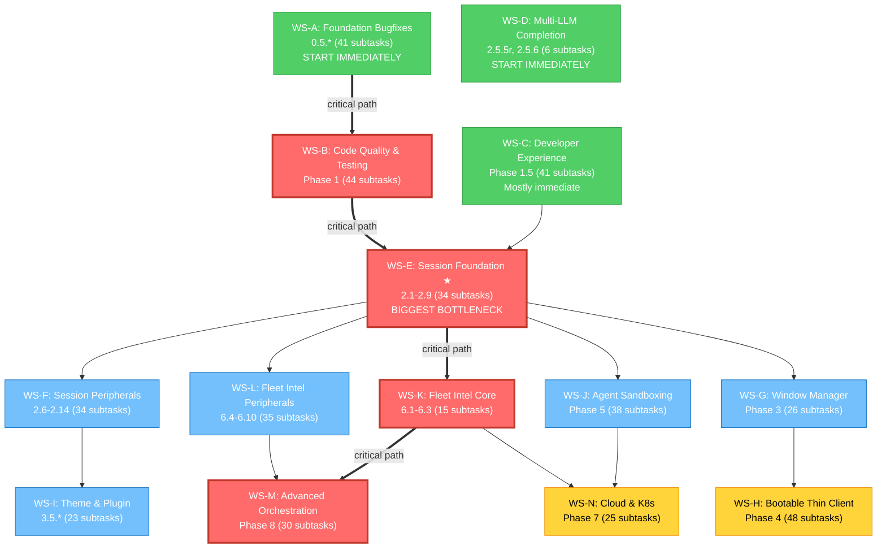

# Workstream Decomposition

Parallel workstream analysis for ralphglasses' 444 open subtasks across ROADMAP Phases 0.5–8. Produced March 2026.

---

## Inventory Summary

- **Total open subtasks**: 444 across 83 sections
- **Complete**: Phase 0, Phase 2.5.1–2.5.4, Phase 2.75 (76 items)
- **Phases with open work**: 0.5, 1, 1.5, 2, 2.5 (partial), 3, 4, 5, 6, 7, 8
- **Immediately parallelizable**: 186 subtasks (42% of total)

---

## Workstream Summary

| WS | Name | ROADMAP Items | Subtasks | Prerequisites | Complexity | Duration |
|----|------|---------------|----------|---------------|------------|----------|
| A | Foundation Bugfixes | 0.5.1–0.5.11 | 41 | None | S-M | 1-2 wk |
| B | Code Quality & Testing | 1.1–1.10, 1.6 | 44 | WS-A | L | 3-4 wk |
| C | Developer Experience | 1.5.1–1.5.10 | 41 | 0.5.7 (partial) | L | 2-3 wk |
| D | Multi-LLM Completion | 2.5.5r, 2.5.6 | 6 | None | M | 2-3 wk |
| E | Session Foundation | 2.1–2.5, 2.8–2.9 | 34 | WS-B + WS-C | XL | 4-6 wk |
| F | Session Peripherals | 2.6–2.7, 2.10–2.14 | 34 | 2.1 (partial) | L | 3-4 wk |
| G | Window Manager | 3.1–3.6 | 26 | 2.1 (partial) | L | 3-5 wk |
| H | Bootable Thin Client | 4.1–4.10 | 48 | Phase 3 (partial) | XL | 4-6 wk |
| I | Theme & Plugin | 3.5.1–3.5.5 | 23 | 2.13, 3.5.1 (partial) | M | 2-3 wk |
| J | Agent Sandboxing | 5.1–5.8 | 38 | 2.1, 2.3 (partial) | XL | 5-7 wk |
| K | Fleet Intel Core | 6.1–6.3 | 15 | 2.1 | XL | 4-6 wk |
| L | Fleet Intel Peripherals | 6.4–6.10 | 35 | 2.11, 6.4 (partial) | XL | 4-6 wk |
| M | Advanced Orchestration | 8.1–8.6 | 30 | 6.1, 6.2 (partial) | XL | 6-8 wk |
| N | Cloud & Kubernetes | 7.1–7.5 | 25 | Phase 5+6 (partial) | XL | 5-7 wk |

---

## Critical Path

The longest sequential dependency chain determines minimum project duration:

```
WS-A (Phase 0.5)  →  WS-B (Phase 1)  →  WS-E (2.1 Session Model)  →  WS-K (6.1 Native Loop)  →  WS-M (Phase 8)
    1-2 wk              3-4 wk              4-6 wk                       4-6 wk                     6-8 wk
```

**Critical path duration**: ~18-26 weeks (4.5-6.5 months) for the sequential spine. All other work runs in parallel alongside it.

### Highest-Value Unblocking Items

| Rank | Item | What It Unblocks | Downstream Subtasks |
|------|------|-----------------|---------------------|
| 1 | **2.1** (Session Data Model) | 2.2, 2.3, 2.4, 2.5, 2.6, 2.7, 2.8, 2.9, 3.3, 5.1, 5.2, 6.1, 6.3 | 200+ |
| 2 | **0.5.1** (Error suppression fix) | 1.8 (custom error types) → cascades to Phase 2 | ~49 |
| 3 | **0.5.2** (Watcher error handling) | 1.7 (structured logging) → cascades to Phase 2 | ~49 |
| 4 | **6.1** (Native loop engine) | 6.2, 6.3, 8.1, 8.3 → transitively 8.5 | ~30 |
| 5 | **3.1** (i3 IPC client) | 3.2, 3.3 → all of Phase 4 core | ~45 |
| 6 | **0.5.7** (Version string) | 1.5.2 (release automation) | ~6 |
| 7 | **4.1** (ISO pipeline) | 4.2, 4.3, 4.5, 4.10 | ~20 |
| 8 | **7.1** (K8s operator) | 7.2, 7.4 | ~10 |

---

## Dependency Graph



---

## Tier 0: Start Immediately (186 subtasks, zero prerequisites)

These 11 sub-workstreams can begin today with no blockers:

| # | Sub-workstream | Items | Subtasks | Notes |
|---|---------------|-------|----------|-------|
| 1 | **WS-A**: Foundation Bugfixes | 0.5.1–0.5.11 | 41 | **Highest priority** — unblocks critical path |
| 2 | **WS-C** (9 of 10): DX Immediate | 1.5.1, 1.5.3–1.5.10 | 35 | All except 1.5.2 (needs 0.5.7) |
| 3 | **WS-F** (5 of 7): Session Peripherals | 2.10–2.14 | 25 | Marathon port, Health, Telemetry, Plugin, SSH |
| 4 | **WS-D**: Batch API | 2.5.6 | 5 | Fully independent |
| 5 | **WS-G** (3 of 6): WM Immediate | 3.4, 3.5, 3.6 | 12 | autorandr, Sway, Hyprland |
| 6 | **WS-H** (5 of 10): Thin Client Immediate | 4.4, 4.6–4.9 | 21 | HW profiles, OTA, Watchdog, Marathon, Secure boot |
| 7 | **WS-I** (3 of 5): Theme Immediate | 3.5.1, 3.5.3, 3.5.4 | 13 | Theme ecosystem, Aliases, MCP skill export |
| 8 | **WS-J** (4 of 8): Sandbox Immediate | 5.3, 5.6–5.8 | 19 | MCP gateway, Secrets, Firecracker, gVisor |
| 9 | **WS-L** (5 of 7): Intel Immediate | 6.5, 6.6, 6.8–6.10 | 25 | Notifications, Model routing, A/B, NL control, Forecasting |
| 10 | **WS-M** (3 of 6): Orch Immediate | 8.2, 8.4, 8.6 | 15 | Prompt mgmt, Code review, Knowledge graph |
| 11 | **WS-N** (2 of 5): Cloud Immediate | 7.3, 7.5 | 10 | Multi-cloud, GitOps |

---

## Execution Timeline

| Week | Critical Path Work | Parallel Work (highlights) |
|------|-------------------|---------------------------|
| 1-2 | WS-A: All 0.5.* bugfixes | WS-C, WS-F(imm), WS-I(imm), WS-H(imm) |
| 3-4 | WS-B: 1.1, 1.2, 1.3, 1.7, 1.8, 1.9, 1.10 | WS-C(1.5.2), WS-D, WS-G(imm), WS-J(imm) |
| 5-6 | WS-B: 1.4 (needs 1.1), then 1.6 (needs all) | WS-L(imm), WS-M(imm), WS-N(imm) |
| 7-9 | **WS-E: 2.1 Session Model** (top priority) | Continue all parallel peripherals |
| 10-12 | WS-E: 2.2, 2.3 (parallel), then 2.5, 2.8 | WS-F(dep): 2.6, 2.7; WS-G(dep): 3.1 |
| 13-15 | **WS-K: 6.1 Native Loop Engine** | WS-G: 3.2, 3.3; WS-J(dep): 5.1, 5.2, 5.4, 5.5 |
| 16-18 | WS-K: 6.2, 6.3 | WS-H(dep): 4.1 ISO; WS-L(dep): 6.4, 6.7 |
| 19-22 | WS-M(dep): 8.1, 8.3, 8.5 | WS-H: 4.2, 4.3, 4.5; WS-N(dep): 7.1 |
| 23-26 | WS-M: completion | WS-N: 7.2, 7.4; WS-H: completion |

---

## Workstream Details

### WS-A: Foundation Bugfixes (Phase 0.5)

All 11 items are fully parallel — zero inter-dependencies. This is the highest-priority workstream because it unblocks the critical path.

| Item | Description | Subtasks | Complexity |
|------|-------------|----------|------------|
| 0.5.1 | Silent error suppression in RefreshRepo | 4 | S |
| 0.5.2 | Watcher error handling | 4 | S |
| 0.5.3 | Process reaper exit status | 5 | M |
| 0.5.4 | Getpgid fallback safety | 4 | M |
| 0.5.5 | Distro path mismatch | 3 | S |
| 0.5.6 | Grub AMD iGPU fallback | 4 | S |
| 0.5.7 | Hardcoded version string | 5 | S |
| 0.5.8 | CI BATS guard | 4 | S |
| 0.5.9 | Race condition in MCP scan | 3 | S |
| 0.5.10 | Marathon.sh edge cases | 5 | M |
| 0.5.11 | Config validation strictness | 4 | S |

### WS-B: Code Quality & Testing (Phase 1)

Sequential spine: 1.1 → 1.4 → 1.6. Parallel wings: 1.2, 1.3, 1.5, 1.7, 1.8, 1.9, 1.10.

| Item | Description | Subtasks | Depends On |
|------|-------------|----------|------------|
| 1.1 | Integration test lifecycle | 4 | WS-A |
| 1.2 | MCP server hardening | 4 | WS-A |
| 1.3 | TUI polish | 4 | WS-A |
| 1.4 | Process manager improvements | 4 | 1.1 |
| 1.5 | Config editor enhancements | 4 | WS-A |
| 1.7 | Structured logging | 5 | 0.5.2 |
| 1.8 | Custom error types | 5 | 0.5.1 |
| 1.9 | Context propagation | 5 | WS-A |
| 1.10 | TUI bounds safety | 5 | WS-A |
| 1.6 | Test coverage targets | 4 | ALL of 1.1-1.10 |

### WS-C: Developer Experience (Phase 1.5)

All items parallel except 1.5.2 (needs 0.5.7 for ldflags).

| Item | Description | Subtasks |
|------|-------------|----------|
| 1.5.1 | Shell completions | 5 |
| 1.5.2 | Release automation | 6 (blocked by 0.5.7) |
| 1.5.3 | Pre-commit hooks | 4 |
| 1.5.4 | Config schema docs | 5 |
| 1.5.5 | Man page generation | 3 |
| 1.5.6 | Multi-arch builds | 4 |
| 1.5.7 | Nix flake | 3 |
| 1.5.8 | Dev containers | 3 |
| 1.5.9 | Documentation site | 4 |
| 1.5.10 | Benchmarking infra | 4 |

### WS-E: Session Foundation (Phase 2 core) — CRITICAL PATH

The single most important workstream. Item 2.1 gates 200+ downstream subtasks.

| Item | Description | Subtasks | Depends On |
|------|-------------|----------|------------|
| 2.1 | Session data model (SQLite) | 5 | WS-B + WS-C |
| 2.2 | Git worktree orchestration | 5 | 2.1 |
| 2.3 | Budget tracking | 5 | 2.1 |
| 2.4 | Fleet dashboard TUI view | 5 | 2.1 |
| 2.5 | Session launcher | 5 | 2.1 + 2.2 + 2.3 |
| 2.8 | MCP server expansion | 5 | 2.1 + 2.2 + 2.3 |
| 2.9 | CLI subcommands | 4 | 2.1 |

### WS-F: Session Peripherals (Phase 2 parallel)

| Item | Description | Subtasks | Depends On |
|------|-------------|----------|------------|
| 2.6 | Notification system | 4 | 2.1 |
| 2.7 | tmux integration | 5 | 2.1 |
| 2.10 | Marathon.sh Go port | 5 | None |
| 2.11 | Health check endpoint | 5 | None |
| 2.12 | Telemetry opt-in | 5 | None |
| 2.13 | Plugin system | 5 | None |
| 2.14 | SSH remote management | 5 | None |

### WS-G: Window Manager (Phase 3)

| Item | Description | Subtasks | Depends On |
|------|-------------|----------|------------|
| 3.1 | i3 IPC client | 5 | 2.1 |
| 3.2 | Monitor layout manager | 5 | 3.1 |
| 3.3 | Multi-instance coordination | 4 | 3.1 + 2.1 |
| 3.4 | autorandr integration | 4 | None |
| 3.5 | Sway/Wayland compat | 4 | None |
| 3.6 | Hyprland support | 4 | None |

### WS-H: Bootable Thin Client (Phase 4)

| Item | Description | Subtasks | Depends On |
|------|-------------|----------|------------|
| 4.1 | ISO pipeline | 7 | Phase 3 |
| 4.2 | i3 kiosk config | 6 | 4.1 |
| 4.3 | PXE/network boot | 5 | 4.1 |
| 4.4 | Hardware profiles | 4 | None |
| 4.5 | Install-to-disk | 5 | 4.1 |
| 4.6 | OTA update | 4 | None |
| 4.7 | Health watchdog | 4 | None |
| 4.8 | Marathon hardening | 5 | None |
| 4.9 | Secure boot | 4 | None |
| 4.10 | USB provisioning | 4 | 4.1 |

### WS-J: Agent Sandboxing (Phase 5)

| Item | Description | Subtasks | Depends On |
|------|-------------|----------|------------|
| 5.1 | Docker sandbox | 5 | 2.1 |
| 5.2 | Incus/LXD containers | 5 | 2.1 |
| 5.3 | MCP gateway | 5 | None |
| 5.4 | Network isolation | 4 | 5.1 or 5.2 |
| 5.5 | Budget federation | 5 | 2.3 |
| 5.6 | Secret management | 5 | None |
| 5.7 | Firecracker microVM | 5 | None |
| 5.8 | gVisor runtime | 4 | None |

### WS-K: Fleet Intel Core (Phase 6 sequential) — CRITICAL PATH

| Item | Description | Subtasks | Depends On |
|------|-------------|----------|------------|
| 6.1 | Native ralph loop engine | 5 | 2.1 |
| 6.2 | R&D cycle orchestrator | 5 | 6.1 |
| 6.3 | Cross-session coordination | 5 | 6.1 + 2.1 |

### WS-L: Fleet Intel Peripherals (Phase 6 parallel)

| Item | Description | Subtasks | Depends On |
|------|-------------|----------|------------|
| 6.4 | Analytics & observability | 5 | 2.75.2 (done) + 2.11 |
| 6.5 | External notifications | 5 | 2.75.2 (done) |
| 6.6 | Model routing | 5 | None |
| 6.7 | Replay/audit trail | 5 | 6.4 |
| 6.8 | Multi-model A/B testing | 5 | None |
| 6.9 | Natural language fleet control | 5 | None |
| 6.10 | Cost forecasting | 5 | None |

### WS-M: Advanced Orchestration (Phase 8)

| Item | Description | Subtasks | Depends On |
|------|-------------|----------|------------|
| 8.1 | Multi-agent collaboration | 5 | 6.1 |
| 8.2 | Prompt management | 5 | None |
| 8.3 | Workflow engine | 5 | 6.1 + 2.75.3 |
| 8.4 | Code review automation | 5 | None |
| 8.5 | Self-improvement engine | 5 | 6.2 |
| 8.6 | Codebase knowledge graph | 5 | None |

### WS-N: Cloud & Kubernetes (Phase 7)

| Item | Description | Subtasks | Depends On |
|------|-------------|----------|------------|
| 7.1 | Kubernetes operator | 5 | Phase 5 + 6 |
| 7.2 | Autoscaling | 5 | 7.1 |
| 7.3 | Multi-cloud support | 5 | None |
| 7.4 | Cloud cost management | 5 | 7.1 |
| 7.5 | GitOps deployment | 5 | None |

---

## Architectural Observations

1. **Item 2.1 is the single biggest bottleneck.** Consider splitting into sub-milestones: schema definition first (unblocks downstream immediately), then CRUD, then state machine.

2. **The distro/thin client track (Phases 3, 4) is nearly independent of the software intelligence track (Phases 5, 6, 8).** They converge only at Phase 7 (K8s). A hardware-focused engineer and a software-focused engineer could work independently for months.

3. **Phase 3.5 (Theme & Plugin)** has no downstream dependents. Pure enrichment — schedule opportunistically.

4. **Item 6.1 (Native Loop Engine)** is the second-biggest bottleneck after 2.1. It gates 6.2, 6.3, 8.1, 8.3, and transitively 8.5. Its dependency on mcpkit/ralph makes it high-risk.

5. **42% of all work (186 subtasks) is immediately parallelizable.** This is unusually high and reflects good decomposition in the ROADMAP itself.

---

## Item-Level Dependency Reference

```
0.5.1 (error fix) ──→ 1.8 (custom error types)
0.5.2 (watcher fix) ──→ 1.7 (structured logging)
0.5.7 (version) ──→ 1.5.2 (release automation)

1.1 ──→ 1.4 (fixtures for PID file tests)
1.* ──→ 1.6 (coverage targets depend on all Phase 1)

2.1 ──→ 2.2, 2.3, 2.4, 2.5, 2.8 (session model foundation)
2.1 + 2.2 + 2.3 ──→ 2.5 (launcher needs worktrees + budget)
2.3 ──→ 5.5 (budget federation extends tracking)
2.11 (health endpoint) ──→ 6.4 (prometheus reuses HTTP server)

3.1 ──→ 3.2, 3.3 (i3 IPC foundation)
2.1 + 3.1 ──→ 3.3 (multi-instance needs SQLite + i3)

4.1 ──→ 4.2, 4.5, 4.10 (ISO pipeline first)
5.1 or 5.2 ──→ 5.4 (network isolation needs sandbox)

6.1 ──→ 6.2, 6.3, 8.3 (native loop engine)
6.2 ──→ 8.5 (self-improvement needs R&D cycle)
6.4 ──→ 6.7 (analytics for replay)

7.1 ──→ 7.2, 7.4 (K8s operator first)

2.75.2 (event bus) ──→ 6.4, 6.5 (analytics + notifications)
2.75.3 (workflow tools) ──→ 8.3 (workflow engine)
```
